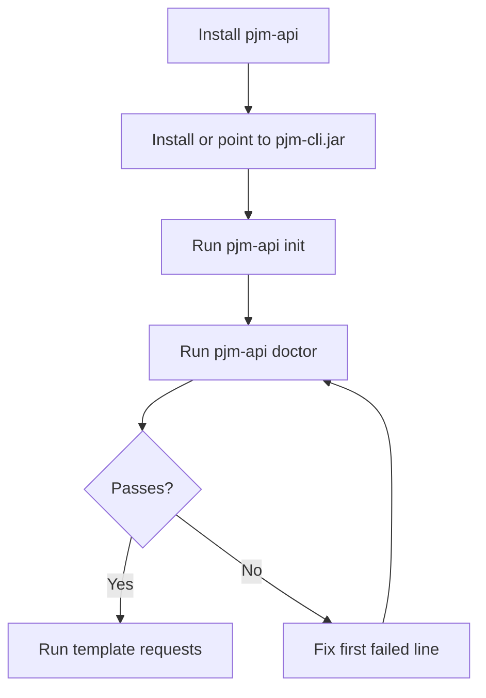
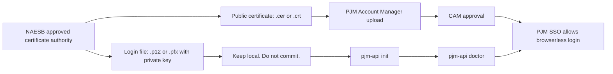
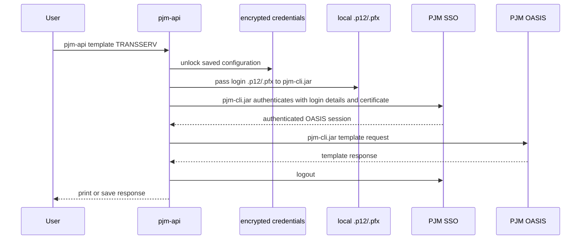

# pjm-api

A small Python CLI and client for PJM OASIS browserless access.

`pjm-api` is meant to make the normal user path boring: clone the repo, install the package, run setup, verify the setup, and run a PJM OASIS template request.

This project is unofficial and is not affiliated with PJM.

## Goal

The goal is simple:

```text
clone -> install -> pjm-api init -> pjm-api doctor -> pjm-api guide -> pjm-api template TRANSSERV
```

A user should not need to understand the full PJM browserless authentication flow before making a basic request. The package should hide the mechanical parts while still making failures easy to diagnose.

Keep the project small. The Java CLI backend is the default path because it matches PJM's official CLI behavior. The native Python backend remains available for advanced use.

## Requirements

| Requirement | Notes |
|---|---|
| Python | Python 3.10 or newer |
| Java | Java 8 or newer, available as `java` or configured with `PJM_CLI_JAVA_PATH` |
| PJM Java CLI | Local `pjm-cli.jar`; `~/.pjm/cli/pjm-cli.jar` is auto-detected |
| PJM account | Access to the PJM environment you want to use |
| Login certificate | Local `.p12` or `.pfx` file containing the private key and certificate |
| Account Manager approval | Matching public certificate uploaded in PJM Account Manager and approved by the CAM |

Install with the `pfx` extra when you want local PKCS#12 certificate inspection or the native Python backend.

## Quick start

**Full walkthrough:** [docs/setup.md](docs/setup.md)

Notebook walkthrough: [pjm_oasis_cli_quickstart.ipynb](pjm_oasis_cli_quickstart.ipynb)

```bash
git clone https://github.com/willschenk/pjm-api.git
cd pjm-api
python -m pip install -e ".[pfx]"
pjm-api cli install --dir ~/.pjm/cli
pjm-api init
```

The default jar install path is auto-detected. If you keep `pjm-cli.jar` elsewhere, set `PJM_CLI_JAR_PATH=/path/to/pjm-cli.jar` or pass `--jar-path`.

The setup command prompts for PJM login details, the local certificate file, the PJM environment, and a local master key for the encrypted credentials file.

Verify everything:

```bash
pjm-api doctor
```

No network yet? Run `pjm-api doctor --offline` to check local credentials and certificate only.

After setup, run `pjm-api guide` to see API call options and available templates.

Expected shape of a passing result:

```text
[1/3] credentials file               OK  (~/.pjm/credentials.enc)
[2/3] certificate file               OK  (expires 2027-03-15)
[3/3] TRANSSERV smoke (TRAIN)        OK

All checks passed.
```

Run a first request:

```bash
pjm-api template TRANSSERV
```

Use production only after training works:

```bash
pjm-api template TRANSSERV --env PRODUCTION
```

Production read requests print a warning by default. Production write or reservation-style actions are blocked unless you explicitly set `PJM_ALLOW_PRODUCTION_WRITE=1` or pass `--allow-production-write`. Disable only the warning with `PJM_DISABLE_PRODUCTION_WARNING=1` or `--no-production-warning`.

## Setup flow



## Certificate model

PJM uses two certificate shapes. They are not interchangeable.



Use the `.p12` or `.pfx` file with `pjm-api init`. Upload only the public certificate to Account Manager. Do not commit certificates, local credential files, or `.env` files.

## Runtime flow



## Python usage

```python
from pjm_api import CliBackend, load_settings

backend = CliBackend(load_settings())
ok = backend.smoke_test()
print("ok:", ok)
```

See [docs/python-usage.md](docs/python-usage.md) for CLI backend examples, native examples, saving responses, and credential handling.

## CLI reference

| Command | Purpose |
|---|---|
| `pjm-api init` | Create the encrypted local credentials file |
| `pjm-api doctor` | Check credentials, certificate, and TRANSSERV smoke request |
| `pjm-api doctor --offline` | Check local credentials and certificate only |
| `pjm-api guide` | Show API call options and available templates |
| `pjm-api smoke` | Run TRANSSERV smoke test |
| `pjm-api cert-doctor` | Inspect the configured certificate |
| `pjm-api credentials show` | Show a redacted credential summary |
| `pjm-api credentials rotate-password` | Change the local master key |
| `pjm-api config` | Show resolved settings without printing secrets |
| `pjm-api auth-check` | Test SSO authentication only |
| `pjm-api auth-check --full` | Test SSO and TRANSSERV |
| `pjm-api template NAME` | Run an OASIS template (preview to stdout) |
| `pjm-api templates list` | List known template metadata |
| `pjm-api templates info NAME` | Show metadata for one template |

Examples:

```bash
pjm-api guide
pjm-api cert-doctor
pjm-api credentials show
pjm-api template TRANSSERV
pjm-api template TRANSSERV --preview-chars 500
pjm-api template TRANSSERV --outfile result.txt
pjm-api template TRANSSERV --save /tmp/result.txt
pjm-api template TRANSSERV --output-format DATA --query-param RETURN_TZ=EP
pjm-api template TRANSSERV --env PRODUCTION
pjm-api template TRANSSERV --env TEST --oasis-url https://private.example/OASIS/
```

## Configuration order

Settings resolve in this order:

1. CLI arguments.
2. Encrypted credentials from `pjm-api init`.
3. Environment variables and `.env` compatibility values.

Default encrypted credentials path:

```text
~/.pjm/credentials.enc
```

Prefer `pjm-api init` for normal use. Use environment variables only for controlled automation.

The public OASIS environments are:

| Name | URL |
|---|---|
| TRAIN | `https://oasisrefreshtrain.pjm.com/OASIS/` |
| PRODUCTION | `https://pjmoasis.pjm.com/OASIS/` |

`TEST` and `STAGE` are recognized names but have blank URLs by default. If you have access to either private environment, pass `--oasis-url` or set `PJM_OASIS_URL`.

Production controls:

| Setting | Purpose |
|---|---|
| `PJM_DISABLE_PRODUCTION_WARNING=1` / `--no-production-warning` | Suppress the production warning |
| `PJM_ALLOW_PRODUCTION_WRITE=1` / `--allow-production-write` | Allow production write/reservation actions |

## Troubleshooting

Start here:

```bash
pjm-api doctor
pjm-api doctor --offline
```

The first failing line is the thing to fix.

| Failure | Most likely fix |
|---|---|
| `credentials file FAIL` | Run `pjm-api init` |
| `certificate file FAIL` | Confirm the `.p12` or `.pfx` path and certificate secret |
| `PJM CLI jar FAIL` | Run `pjm-api cli install --dir ~/.pjm/cli` or set `PJM_CLI_JAR_PATH=/path/to/pjm-cli.jar` |
| `java runtime FAIL` | Install Java 8+ or set `PJM_CLI_JAVA_PATH=/path/to/java` |
| `Public certificate only` | Use the login `.p12` or `.pfx`, not the public `.cer` or `.crt` |
| `PKCS#12 requires [pfx] extra` | Reinstall with `python -m pip install -e ".[pfx]"` |
| `SSO authentication FAIL` | Check login details, certificate approval, and environment |
| `TRANSSERV smoke FAIL` | Authentication worked, but the OASIS request failed. Check access and template parameters |

More detail: [docs/troubleshooting.md](docs/troubleshooting.md)

## Documentation

- [Setup walkthrough](docs/setup.md)
- [Troubleshooting](docs/troubleshooting.md)
- [Python usage](docs/python-usage.md)
- [Advanced](docs/advanced.md)
- [Security](SECURITY.md)

## Development

```bash
python -m pip install -e ".[dev,pfx]"
ruff check .
mypy src/pjm_api
pytest tests/ -m "not live"
```

Live tests require real PJM credentials and explicit opt-in:

```bash
export PJM_LIVE_TEST=1
pytest tests/ -m live
```

See [CONTRIBUTING.md](CONTRIBUTING.md).

## Reference material

Authoritative behavior comes from PJM and NAESB material. Start with:

- [PJM OASIS API User Guide](https://www.pjm.com/-/media/DotCom/etools/oasis/pjm-oasis-api-user-guide.pdf)
- [PJM PKI FAQs](https://www.pjm.com/-/media/DotCom/etools/security/pki-faqs.pdf)
- [PJM eTools](https://www.pjm.com/markets-and-operations/etools)

## License

MIT
