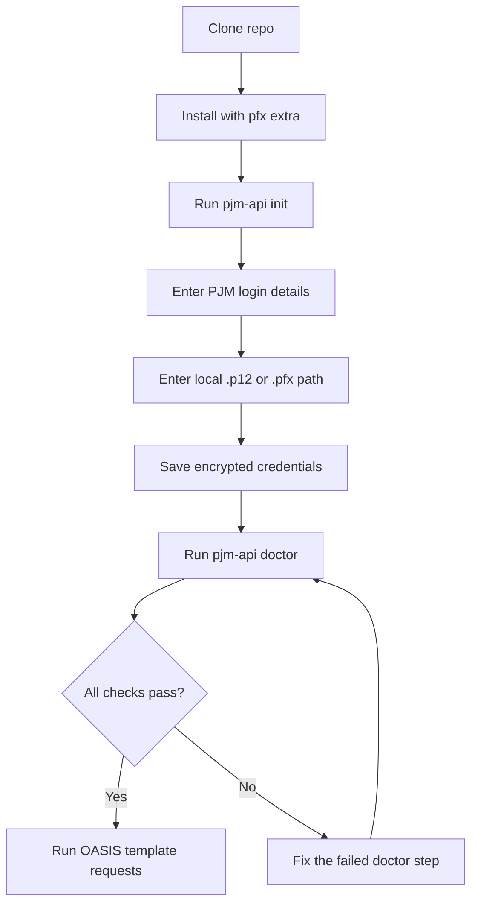
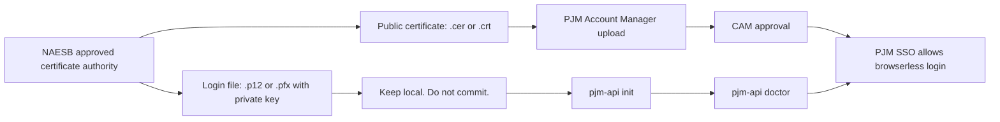
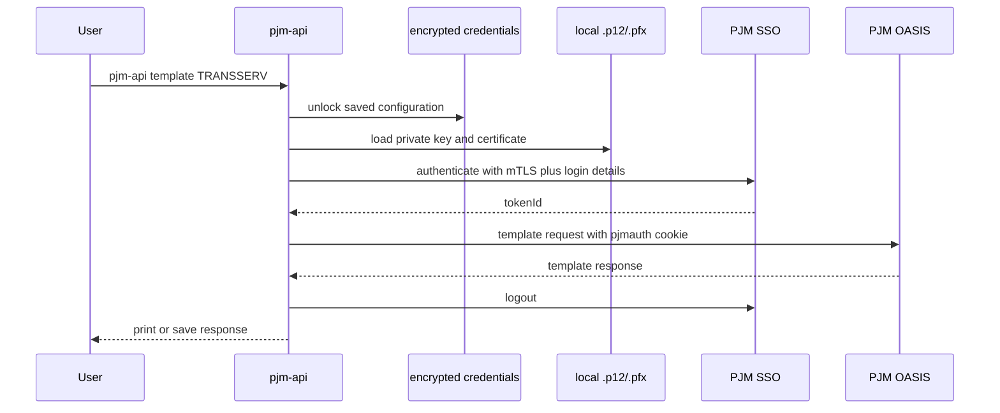

# pjm-api

A small Python CLI and client for PJM OASIS browserless access.

`pjm-api` is meant to make the normal user path boring: clone the repo, install the package, run setup, verify the setup, and run a PJM OASIS template request.

This project is unofficial and is not affiliated with PJM.

## Goal

The goal is simple:

```text
clone -> install -> pjm-api init -> pjm-api doctor -> pjm-api template TRANSSERV
```

A user should not need to understand the full PJM browserless authentication flow before making a basic request. The package should hide the mechanical parts while still making failures easy to diagnose.

Keep the project small. Native Python is the default path. The Java CLI backend is an advanced fallback.

## Requirements

| Requirement | Notes |
|---|---|
| Python | Python 3.10 or newer |
| PJM account | Access to the PJM environment you want to use |
| Login certificate | Local `.p12` or `.pfx` file containing the private key and certificate |
| Account Manager approval | Matching public certificate uploaded in PJM Account Manager and approved by the CAM |

Install with the `pfx` extra for normal `.p12` or `.pfx` use.

## Quick start

```bash
git clone https://github.com/willschenk/pjm-api.git
cd pjm-api
python -m pip install -e ".[pfx]"
pjm-api init
```

The setup command prompts for PJM login details, the local certificate file, the PJM environment, and a local master key for the encrypted credentials file.

Verify everything:

```bash
pjm-api doctor
```

Expected shape of a passing result:

```text
[1/4] credentials file               OK  (/Users/you/.pjm/credentials.enc)
[2/4] certificate file               OK  (expires 2027-03-15)
[3/4] SSO authentication             OK
[4/4] TRANSSERV smoke (TRAIN)        OK

All checks passed.
```

Run a first request:

```bash
pjm-api template TRANSSERV
```

Use production only after training works:

```bash
pjm-api template TRANSSERV --env PRODUCTION
```

## Setup flow



## Certificate model

PJM uses two certificate shapes. They are not interchangeable.



Use the `.p12` or `.pfx` file with `pjm-api init`. Upload only the public certificate to Account Manager. Do not commit certificates, local credential files, or `.env` files.

## Runtime flow



## Python usage

```python
from pjm_api import OasisClient, load_settings

with OasisClient(load_settings()) as client:
    response = client.smoke_transserv()
    print(response.text()[:500])
```

Run a specific template:

```python
from pjm_api import OasisClient, load_settings

params = {
    "OUTPUT_FORMAT": "DATA",
    "PRIMARY_PROVIDER_CODE": "PJM",
    "PRIMARY_PROVIDER_DUNS": "073647877",
    "RETURN_TZ": "EP",
    "VERSION": "3.3",
}

with OasisClient(load_settings()) as client:
    response = client.request("TRANSSERV", params)
    response.save("downloads/transserv.txt")
```

## CLI reference

| Command | Purpose |
|---|---|
| `pjm-api init` | Create the encrypted local credentials file |
| `pjm-api doctor` | Check credentials, certificate, SSO login, and TRANSSERV smoke request |
| `pjm-api cert-doctor` | Inspect the configured certificate |
| `pjm-api credentials show` | Show a redacted credential summary |
| `pjm-api credentials rotate-password` | Change the local master key |
| `pjm-api config` | Show resolved settings without printing secrets |
| `pjm-api auth-check` | Test SSO authentication only |
| `pjm-api auth-check --full` | Test SSO and TRANSSERV |
| `pjm-api template NAME` | Run an OASIS template |
| `pjm-api templates list` | List known template metadata |
| `pjm-api templates info NAME` | Show metadata for one template |

Examples:

```bash
pjm-api cert-doctor
pjm-api credentials show
pjm-api template TRANSSERV --output-format CSV --outfile transserv.csv
pjm-api template TRANSSERV --query-param RETURN_TZ=EP --query-param VERSION=3.3
```

## Configuration order

Settings resolve in this order:

1. CLI arguments.
2. Encrypted credentials from `pjm-api init`.
3. Environment variables and `.env` compatibility values.

Default encrypted credentials path:

```text
~/.pjm/credentials.enc
```

Prefer `pjm-api init` for normal use. Use environment variables only for controlled automation.

## Troubleshooting

Start here:

```bash
pjm-api doctor
```

The first failing line is the thing to fix.

| Failure | Most likely fix |
|---|---|
| `credentials file FAIL` | Run `pjm-api init` |
| `certificate file FAIL` | Confirm the `.p12` or `.pfx` path and certificate secret |
| `Public certificate only` | Use the login `.p12` or `.pfx`, not the public `.cer` or `.crt` |
| `PKCS#12 requires [pfx] extra` | Reinstall with `python -m pip install -e ".[pfx]"` |
| `SSO authentication FAIL` | Check login details, certificate approval, and environment |
| `TRANSSERV smoke FAIL` | Authentication worked, but the OASIS request failed. Check access and template parameters |

More detail: [docs/troubleshooting.md](docs/troubleshooting.md)

## Development

```bash
python -m pip install -e ".[dev,pfx]"
pytest
ruff check .
mypy src
```

Live tests require real PJM credentials and explicit opt-in:

```bash
export PJM_LIVE_TEST=1
pytest tests/live
```

## Project direction

The next improvements should stay practical:

1. Keep native Python as the default path.
2. Keep `pjm-api init` and `pjm-api doctor` as the main user experience.
3. Add tests before changing authentication, certificate, or request logic.
4. Remove dead compatibility paths instead of documenting features that do not work.
5. Keep examples short and copy-pasteable.
6. Do not add abstractions until a real PJM workflow needs them.

## Reference material

Authoritative behavior comes from PJM and NAESB material. Start with:

- [PJM OASIS API User Guide](https://www.pjm.com/-/media/DotCom/etools/oasis/pjm-oasis-api-user-guide.pdf)
- [PJM PKI FAQs](https://www.pjm.com/-/media/DotCom/etools/security/pki-faqs.pdf)
- [PJM eTools](https://www.pjm.com/markets-and-operations/etools)

## License

MIT
