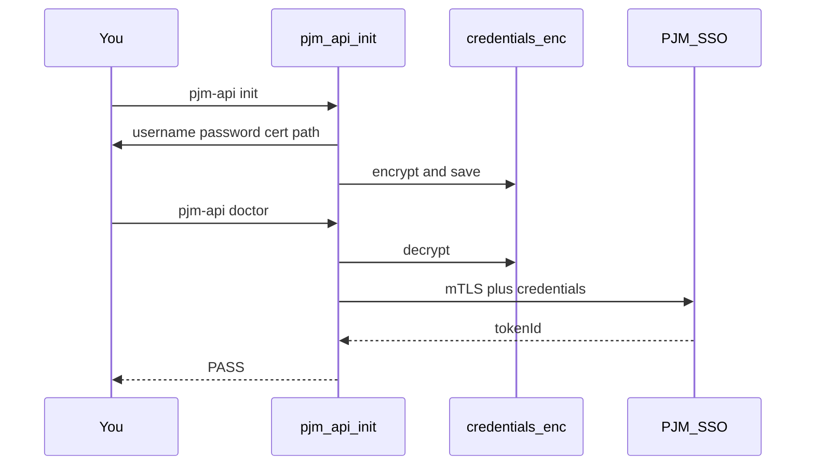
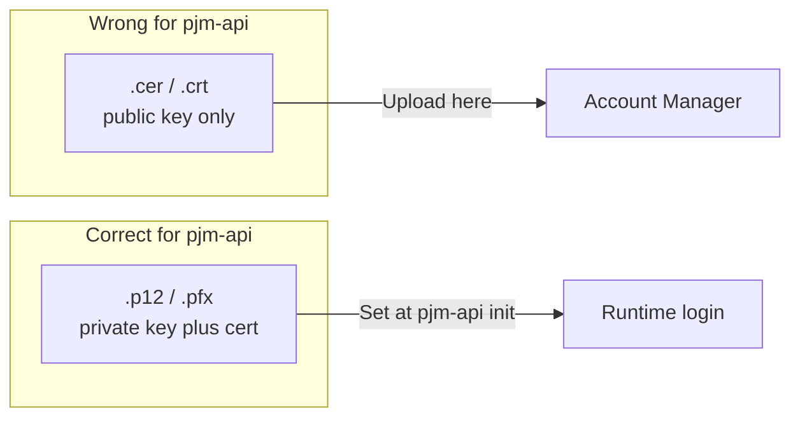
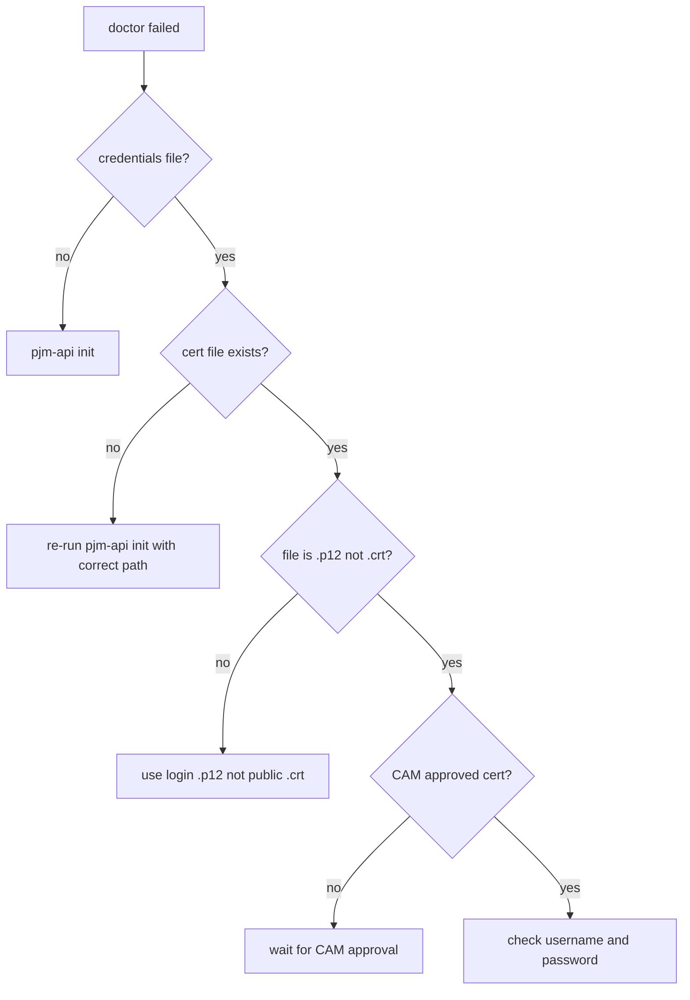

# pjm-api

Python client for PJM OASIS. Unofficial — not affiliated with PJM.

## Quick start

**You need:** Python 3.10+, a login `.p12`/`.pfx` file (private key + cert), CAM-approved public cert in Account Manager.

```bash
git clone https://github.com/willschenk/pjm-api
cd pjm-api
pip install -e ".[pfx]"
pjm-api init
pjm-api doctor
pjm-api template TRANSSERV
```

Expected `doctor` output:

```
[1/4] credentials file             OK  (~/.pjm/credentials.enc)
[2/4] certificate file             OK  (expires 2027-03-15)
[3/4] SSO authentication           OK
[4/4] TRANSSERV smoke (TRAIN)      OK

All checks passed.
```

### Setup flow



## Certificates

PJM uses **two different files**. Mixing them up is the most common failure.



| File | Use |
|------|-----|
| `.cer` / `.crt` | Upload to Account Manager (public key only) |
| `.p12` / `.pfx` | Point `pjm-api init` here (login file) |

## Python

```python
from pjm_api import OasisClient, load_settings

with OasisClient(load_settings()) as client:
    print(client.smoke_transserv().text()[:500])
```

## CLI

```bash
pjm-api doctor                              # verify setup
pjm-api template TRANSSERV                  # print preview to stdout
pjm-api template TRANSSERV --outfile result.txt  # save to downloads/
pjm-api template TRANSSERV --save /tmp/result.txt  # save to exact path
pjm-api template TRANSSERV --env PRODUCTION # production (advanced)
pjm-api credentials show                    # redacted summary
```

## Troubleshooting



See [docs/troubleshooting.md](docs/troubleshooting.md) for error messages.

## Advanced

Java CLI backend, TEST/STAGE environments, live tests: [docs/advanced.md](docs/advanced.md)

## Sources

Based on publicly posted PJM/NAESB documentation. Authoritative specs: [PJM eTools](https://www.pjm.com/markets-and-operations/etools).
