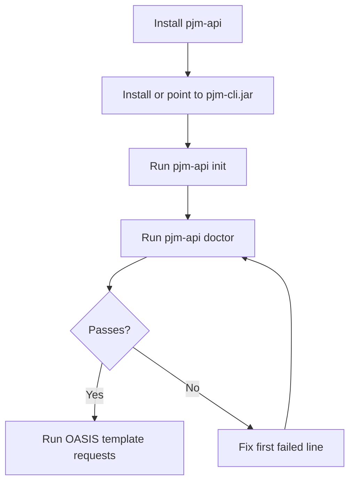
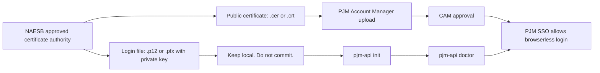
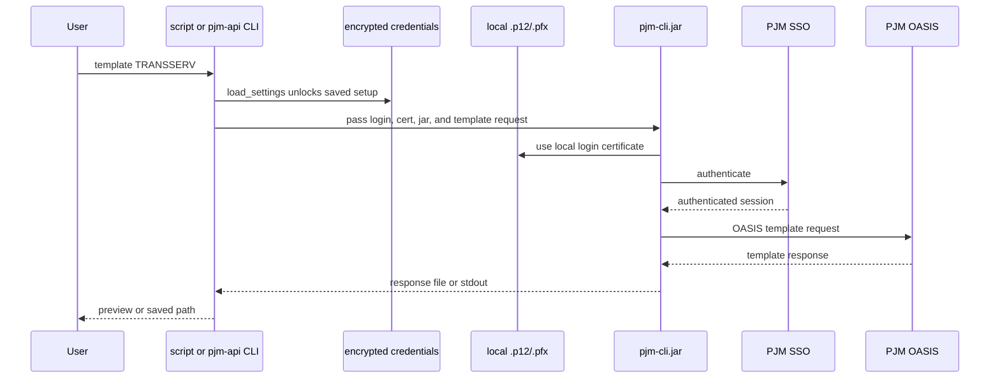

# pjm-api

Lightweight Python tools for PJM APIs, starting with OASIS browserless access.

`pjm-api` is unofficial and is not affiliated with PJM. The goal is a small,
boring repo that helps people get authenticated, run a first request, and build
simple scripts without hiding the PJM-specific setup details.

## PJM API map

| PJM surface | Use it for | Authentication | Status here |
|---|---|---|---|
| Data Miner / API Portal | Public PJM data feeds | API Portal subscription key over normal HTTPS; no NAESB cert or Java CLI | Planned lightweight client |
| OASIS | Transmission service and NAESB WEQ templates | PJM username/password plus approved PKI certificate; Java CLI is the default backend | Supported now |

This repo is meant to grow into a general PJM API toolkit. The current working
path is OASIS. The next priority is a minimal Data Miner path plus NERC registry ingest,
`.xlsx` normalization, reviewable outputs, and dashboard stats.
Compliance modeling is intentionally out of scope for now.

## Quick start

Use TRAIN first.

```bash
git clone https://github.com/willschenk/pjm-api.git
cd pjm-api
python -m pip install -e ".[pfx]"
pjm-api cli install --dir ~/.pjm/cli
pjm-api init
pjm-api doctor
pjm-api template TRANSSERV
```

The default PJM Java CLI jar path is:

```text
~/.pjm/cli/pjm-cli.jar
```

`pjm-api init` saves encrypted local credentials at:

```text
~/.pjm/credentials.enc
```

If your jar lives somewhere else, set `PJM_CLI_JAR_PATH=/path/to/pjm-cli.jar`
or pass `--jar-path`.

No network yet? Run:

```bash
pjm-api doctor --offline
```

Expected full check shape:

```text
[1/3] credentials file               OK  (~/.pjm/credentials.enc)
[2/3] certificate file               OK  (expires 2027-03-15)
[3/3] TRANSSERV smoke (TRAIN)        OK

All checks passed.
```

## Why OASIS is different

Most PJM public-data API work belongs in Data Miner and uses an API Portal key.
OASIS is different:

- OASIS follows NAESB WEQ template conventions.
- PJM's Java CLI is the default request path in this repo because it matches
  PJM's browserless behavior.
- Browserless OASIS login needs a PJM username/password and a local `.p12` or
  `.pfx` certificate file containing the private key.
- The matching public certificate must be uploaded in PJM Account Manager and
  approved by the CAM.

Use the `.p12` or `.pfx` file with `pjm-api init`. Upload only the public
certificate (`.cer`, `.crt`, or similar) to Account Manager. Do not commit
certificates, local credential files, or `.env` files.





## Runtime flow



## Python usage

After setup, scripts should reuse the same saved configuration.

```python
from pjm_api import CliBackend, load_settings

backend = CliBackend(load_settings())
ok = backend.smoke_test()
print("ok:", ok)
```

Template request:

```python
from pjm_api import CliBackend, load_settings

backend = CliBackend(load_settings())
result = backend.run_template(
    template="TRANSSERV",
    params={"OUTPUT_FORMAT": "DATA"},
    outfile="transserv.txt",
)
print("returncode:", result.returncode)
print("output:", result.output_file)
```

For non-interactive automation, set `PJM_MASTER_PASSWORD` in the process
environment so `~/.pjm/credentials.enc` can unlock without a prompt.

## CLI reference

| Command | Purpose |
|---|---|
| `pjm-api init` | Create encrypted local credentials |
| `pjm-api doctor` | Check credentials, certificate, Java CLI, and TRANSSERV |
| `pjm-api doctor --offline` | Check local setup only |
| `pjm-api guide` | Show request options and known templates |
| `pjm-api template NAME` | Run an OASIS template |
| `pjm-api templates list` | List known templates |
| `pjm-api cert-doctor` | Inspect the configured certificate |
| `pjm-api credentials show` | Show redacted credential settings |
| `pjm-api config` | Show resolved settings without secrets |

Examples:

```bash
pjm-api guide
pjm-api template TRANSSERV
pjm-api template TRANSSERV --preview-chars 500
pjm-api template TRANSSERV --outfile result.txt
pjm-api template TRANSSERV --output-format DATA --query-param RETURN_TZ=EP
pjm-api template TRANSSERV --env PRODUCTION
```

Production read requests print a warning by default. Production write or
reservation-style actions are blocked unless you explicitly set
`PJM_ALLOW_PRODUCTION_WRITE=1` or pass `--allow-production-write`.

## Configuration

Settings resolve in this order:

1. CLI arguments.
2. Encrypted credentials from `pjm-api init`.
3. Environment variables and `.env` compatibility values.

Public OASIS environments:

| Name | URL |
|---|---|
| TRAIN | `https://oasisrefreshtrain.pjm.com/OASIS/` |
| PRODUCTION | `https://pjmoasis.pjm.com/OASIS/` |

`TEST` and `STAGE` are recognized names but have blank URLs by default. If you
have access to either private environment, pass `--oasis-url` or set
`PJM_OASIS_URL`.

## Troubleshooting

Start with:

```bash
pjm-api doctor
pjm-api doctor --offline
```

The first failing line is the thing to fix.

| Failure | Most likely fix |
|---|---|
| `credentials file FAIL` | Run `pjm-api init` |
| `certificate file FAIL` | Confirm the `.p12` or `.pfx` path and certificate password |
| `PJM CLI jar FAIL` | Run `pjm-api cli install --dir ~/.pjm/cli` or set `PJM_CLI_JAR_PATH` |
| `java runtime FAIL` | Install Java 8+ or set `PJM_CLI_JAVA_PATH` |
| `Public certificate only` | Use the login `.p12` or `.pfx`, not the public `.cer` or `.crt` |
| `SSO authentication FAIL` | Check login details, certificate approval, and environment |
| `TRANSSERV smoke FAIL` | Authentication worked, but OASIS failed; check access and parameters |

More detail: [docs/troubleshooting.md](docs/troubleshooting.md)

## Development

```bash
python -m pip install -e ".[dev,pfx]"
ruff check .
mypy src/pjm_api
pytest tests/ -m "not live"
```

Live tests require real PJM credentials and explicit opt-in:

```bash
export PJM_LIVE_TEST=1
pytest tests/ -m live
```

## Official references

- [PJM API Portal](https://apiportal.pjm.com/)
- [PJM Data Miner](https://dataminer2.pjm.com/)
- [PJM Data Miner roadmap, June 2026](https://www.pjm.com/-/media/DotCom/committees-groups/forums/tech-change/2026/20260615/20260615-item-04b---product-roadmap---data-miner.pdf)
- [PJM OASIS User Guide](https://www.pjm.com/-/media/DotCom/etools/oasis/oasis-user-guide.pdf)
- [PJM PKI-Based Authentication Guide](https://www.pjm.com/-/media/DotCom/etools/security/pki-authentication-guide.pdf)
- [PJM PKI FAQs](https://www.pjm.com/-/media/DotCom/etools/security/pki-faqs.pdf)
- [NAESB WEQ](https://www.naesb.org/weq/)

## License

MIT
