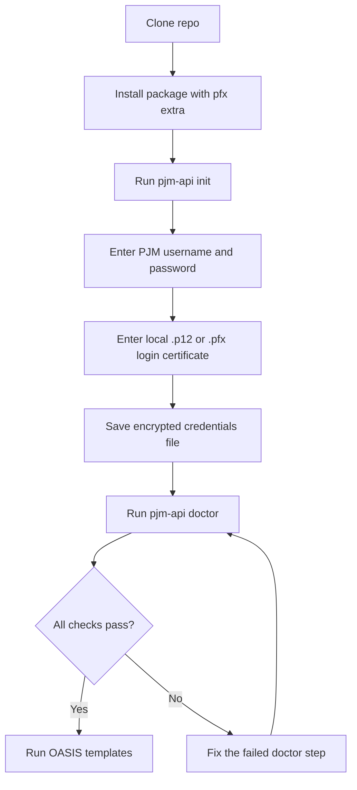
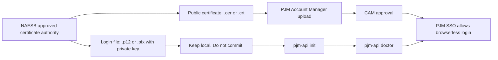
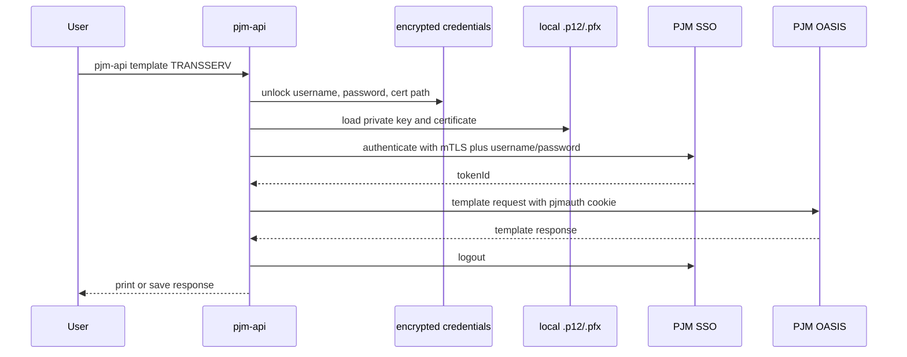

# pjm-api

A small Python CLI and client for PJM OASIS browserless access.

`pjm-api` handles the local setup that usually makes PJM OASIS automation painful: credentials, a login certificate, SSO authentication, the PJM auth cookie, and OASIS template requests.

This project is unofficial and is not affiliated with PJM.

## Goal

A user should be able to:

1. Clone the repository.
2. Install the package.
3. Run `pjm-api init`.
4. Enter a PJM username, PJM password, and login certificate path.
5. Run `pjm-api doctor` and know exactly what is broken if setup fails.
6. Run a PJM OASIS template request from the CLI or Python.

Keep the package small. The default path should be native Python. The Java CLI backend should remain available only as an advanced fallback.

## Requirements

| Requirement | Notes |
|---|---|
| Python | Python 3.10 or newer |
| PJM account | Username and password for the target PJM environment |
| Login certificate | `.p12` or `.pfx` file that contains the private key and certificate |
| Account Manager approval | The matching public certificate must be uploaded in PJM Account Manager and approved by the CAM |

Install with the `pfx` extra unless you are deliberately avoiding PKCS#12 files.

## Quick start

```bash
git clone https://github.com/willschenk/pjm-api.git
cd pjm-api
python -m pip install -e ".[pfx]"
pj m-api init
```

The command above should be:

```bash
pjm-api init
```

`pjm-api init` asks for:

```text
PJM username
PJM password
Path to login .p12/.pfx file
Certificate password
Environment [TRAIN]
Master password for the encrypted local credentials file
```

Then verify the full setup:

```bash
pjm-api doctor
```

A clean setup looks like this:

```text
[1/4] credentials file               OK  (/Users/you/.pjm/credentials.enc)
[2/4] certificate file               OK  (expires 2027-03-15)
[3/4] SSO authentication             OK
[4/4] TRANSSERV smoke (TRAIN)        OK

All checks passed.
```

Run a first request:

```bash
pjm-api template TRANSSERV
```

Use production only when the training setup is working:

```bash
pjm-api template TRANSSERV --env PRODUCTION
```

## Setup flow



## Certificate model

PJM uses two certificate shapes. They are not interchangeable.



Use the `.p12` or `.pfx` file with `pjm-api init`. Upload only the public certificate to Account Manager. Do not commit certificates, passwords, `.env`, or `~/.pjm/credentials.enc`.

## Runtime flow



## Python usage

```python
from pjm_api import OasisClient, load_settings

with OasisClient(load_settings()) as client:
    response = client.smoke_transserv()
    print(response.text()[:500])
```

Run a specific template:

```python
from pjm_api import OasisClient, load_settings

params = {
    "OUTPUT_FORMAT": "DATA",
    "PRIMARY_PROVIDER_CODE": "PJM",
    "PRIMARY_PROVIDER_DUNS": "073647877",
    "RETURN_TZ": "EP",
    "VERSION": "3.3",
}

with OasisClient(load_settings()) as client:
    response = client.request("TRANSSERV", params)
    response.save("downloads/transserv.txt")
```

## CLI reference

| Command | Purpose |
|---|---|
| `pjm-api init` | Create the encrypted local credentials file |
| `pjm-api doctor` | Check credentials, certificate, SSO login, and a TRANSSERV smoke request |
| `pjm-api cert-doctor` | Inspect the configured certificate |
| `pjm-api credentials show` | Show a redacted credential summary |
| `pjm-api credentials rotate-password` | Change the local master password |
| `pjm-api config` | Show resolved settings without printing secrets |
| `pjm-api auth-check` | Test SSO authentication only |
| `pjm-api auth-check --full` | Test SSO and TRANSSERV |
| `pjm-api template NAME` | Run an OASIS template |
| `pjm-api templates list` | List known template metadata |
| `pjm-api templates info NAME` | Show metadata for one template |

Common examples:

```bash
pjm-api cert-doctor
pjm-api credentials show
pjm-api template TRANSSERV --output-format CSV --outfile transserv.csv
pjm-api template TRANSSERV --query-param RETURN_TZ=EP --query-param VERSION=3.3
```

## Configuration order

Settings resolve in this order:

1. CLI arguments, such as `--username`, `--cert`, and `--env`.
2. Encrypted credentials from `pjm-api init`.
3. Environment variables and `.env` compatibility values.

Default encrypted credentials path:

```text
~/.pjm/credentials.enc
```

Override it with:

```bash
export PJM_CREDENTIALS_FILE=/secure/path/credentials.enc
```

Useful environment variables:

| Variable | Purpose |
|---|---|
| `PJM_USERNAME` | PJM username |
| `PJM_PASSWORD` | PJM password |
| `PJM_CERT` | Certificate path, optionally `path|password` |
| `PJM_CERT_PATH` | Certificate path only |
| `PJM_CERT_PASSWORD` | Certificate password |
| `PJM_ENV` | `TRAIN`, `PRODUCTION`, `TEST`, or `STAGE` |
| `PJM_TIMEOUT_SEC` | Request timeout |
| `PJM_MASTER_PASSWORD` | Unlock encrypted credentials without an interactive prompt |

Prefer `pjm-api init` for normal use. Use environment variables for CI or controlled automation.

## Troubleshooting

Start here:

```bash
pjm-api doctor
```

The first failing line is the thing to fix.

| Failure | Most likely fix |
|---|---|
| `credentials file FAIL` | Run `pjm-api init` |
| `certificate file FAIL` | Confirm the `.p12` or `.pfx` path and certificate password |
| `Public certificate only` | Use the login `.p12` or `.pfx`, not the public `.cer` or `.crt` |
| `PKCS#12 requires [pfx] extra` | Reinstall with `python -m pip install -e ".[pfx]"` |
| `SSO authentication FAIL` | Check username, password, certificate approval, and environment |
| `TRANSSERV smoke FAIL` | Authentication worked, but the OASIS request failed. Check template access and parameters |

More detail: [docs/troubleshooting.md](docs/troubleshooting.md)

## Development

```bash
python -m pip install -e ".[dev,pfx]"
pytest
ruff check .
mypy src
```

Run live checks only with real credentials and explicit opt-in:

```bash
export PJM_LIVE_TEST=1
export PJM_MASTER_PASSWORD=...
pytest tests/live
```

## Project direction

The next improvements should stay practical:

1. Keep native Python as the default path.
2. Keep `pjm-api init` and `pjm-api doctor` as the main user experience.
3. Add tests before changing authentication, certificate, or request logic.
4. Remove dead compatibility paths instead of documenting features that do not work.
5. Keep examples short and copy-pasteable.
6. Do not add abstractions until a real PJM workflow needs them.

## Reference material

Authoritative behavior comes from PJM and NAESB material. Start with:

- [PJM OASIS API User Guide](https://www.pjm.com/-/media/DotCom/etools/oasis/pjm-oasis-api-user-guide.pdf)
- [PJM PKI FAQs](https://www.pjm.com/-/media/DotCom/etools/security/pki-faqs.pdf)
- [PJM eTools](https://www.pjm.com/markets-and-operations/etools)

## License

MIT
